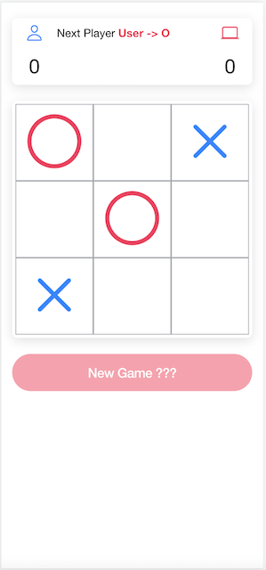
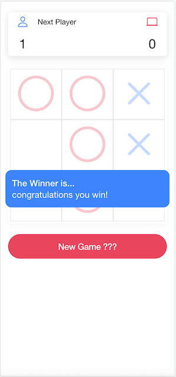

# Tic-Tac-Toe

This is a rooster game, build with:

- ionic framework V6
- angular V13
- capacitor android and ios V3.4.0
- typescript V4.4.4

This game can run in browser / android / ios

This project uses Ionic as app development platform and the Ionic CLI.

#

# Development Setup 💻

### Prerequisites

- Install Node.js which includes Node Package Manager
- Android development: Install Android Studio
- iOS development: Install XCode

## Getting Started

**Clone this repository:**

> git clone https://github.com/marcoagsa/RoosterGame.git

**Change to the root directory of the project:**

> cd RoosterGame

**Install all dependencies:**

> npm i

**Prepare and launch the Android app:**

> npx ionic cap sync android
>
> npx ionic cap run android

**Prepare and launch the iOS app:**

> npx ionic cap sync ios
>
> npx ionic cap run ios

**Android APK - DEMO:**

> https://jof7uh.s.cld.pt
