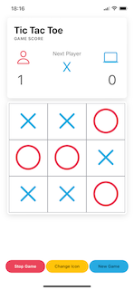
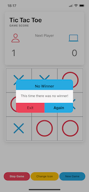

# Tic-Tac-Toe Game

Welcome to the Tic-Tac-Toe game project! This project utilizes Ionic 7 and Angular 17 with standalone versions, incorporating the latest enhancements and components from Angular 17. Additionally, it employs Capacitor iOS and Android version 5 for cross-platform functionality.

About the Project
This game offers a classic Tic-Tac-Toe experience where players challenge an intelligent logic designed to thwart the user's victory. It's an engaging battle against an AI that strategizes to prevent your win in this timeless game.

#### Feel free to explore, contribute, or provide feedback to enhance this project further!

#### Feel free to adjust the wording or details as needed for your project's specifics!

This is a Tic-Tac-Toe game, build with:

- Ionic framework V7
- Angular V17
- Capacitor android and ios V5
- typescript V5

This game can run in browser / android / ios

This project uses Ionic as app development platform and the Ionic CLI.
This project uses angular standalone components

# Game Images

# Game Video

https://github.com/marcoagsa/Tic-Tac-Toe/assets/14275804/1fc9f00b-19d8-4d40-a455-eecfdfcd3c0f

# Development Setup 💻

### Prerequisites

- Install Node.js which includes Node Package Manager
- Android development: Install Android Studio
- iOS development: Install XCode

## Getting Started

**Clone this repository:**

> git clone https://github.com/marcoagsa/Tic-Tac-Toe.git

**Change to the root directory of the project:**

> cd Tic-tac-toe

**Install all dependencies:**

> npm i or yarn

**Prepare and launch the Android app:**

> npx ionic cap sync android
>
> npx ionic cap run android

**Prepare and launch the iOS app:**

> npx ionic cap sync ios
>
> npx ionic cap run ios
