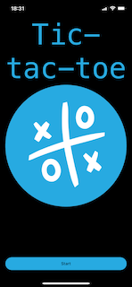

# Tic-Tac-Toe

This is a rooster game, build with:

- Ionic framework V7
- Angular V17
- Capacitor android and ios V5
- typescript V5

This game can run in browser / android / ios

This project uses Ionic as app development platform and the Ionic CLI.
This project uses angular standalone components

#

# Development Setup 💻

### Prerequisites

- Install Node.js which includes Node Package Manager
- Android development: Install Android Studio
- iOS development: Install XCode

## Getting Started

**Clone this repository:**

> git clone https://github.com/marcoagsa/Tic-Tac-Toe.git

**Change to the root directory of the project:**

> cd Tic-tac-toe

**Install all dependencies:**

> npm i or yarn

**Prepare and launch the Android app:**

> npx ionic cap sync android
>
> npx ionic cap run android

**Prepare and launch the iOS app:**

> npx ionic cap sync ios
>
> npx ionic cap run ios
